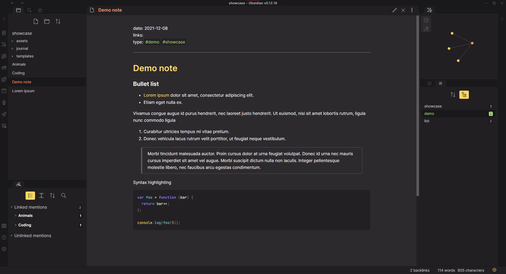

# Monokai pro for Obsidian

---

Monokai Pro port for Obsidian
This is my first theme, I tried to balance it between being fancy and not distracting the user

It's Based on:

- **[Monokai Pro](https://monokai.pro/)** colors palette
- **[Obsidian Atom](https://github.com/kognise/obsidian-atom)** for the code

---

## Installing

### install as local theme

1. download or clone the github repo
2. extract monokai-pro.css to _your_vault_location/.obsidian/theme_
3. open obsidian, go to "settings > appareance > Manage" and select monokai-pro

### Install as CSS snippet

1. download or clone the github repo
2. extract monokai-pro.css to _your_vault_location/.obsidian/snippets_
3. open obsidian, go to "settings > appareance" and under CSS snippets enable monokai-pro
